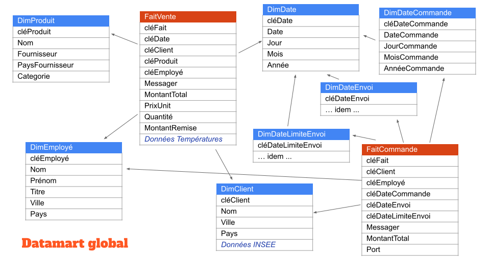

# Intégration de données

Nous allons réaliser le processus ETL sur le datamart vu en cours. Vous devez d'abord télécharger la base [`Comptoir2000`](https://fxjollois.github.io/donnees/Comptoir2000/Comptoir2000.sqlite) au format `SQLite`. Pour rappel, voici le schéma du datamart souhaité.



## Connexion à une BD dans R

**Note** : installer les packages `DBI` et `RSQLite` dans R avant l'exécution du code qui suit. 

### Etablir la connexion

Il est possible de se connecter à une BD sous R, en grande partie grâce au package `DBI`, et à d'autres packages spécifiques pour chaque moteur (`SQLite`, `Oracle`, `SQL Server`, ...). Par exemple, pour se connecter à la base `Comptoir2000` au format `SQLite`, il est possible de procéder ainsi :

```r
library(DBI)
# Connexion à la BD
cpt = dbConnect(RSQLite::SQLite(), "Comptoir2000.sqlite")

# Liste des tables
dbListTables(cpt)

# Déconnexion de la BD
dbDisconnect(cpt)
```

Pour information, lorsqu'on se connecte à un fichier inexistant, celui-ci est créée automatiquement. De plus, cette connexion est en mode écriture, ce qui fait que toute modification de la base est sauvegardée.

### Fonctions utiles

| Fonction | Rôle |
|-|-|
| `dbConnect()` | Connexion à la BD <br> si fichier inexistant, création automatique |
| `dbDisconnect()` | Déconnexion de la BD <br> à faire à la fin du script |
| `dbListTables()` | Liste des tables de la BD |
| `dbListFields()` | Liste des champs d'une table spécifique |
| `dbReadTable()` | Lecture d'une table <br> équivalent à un `SELECT *` |
| `dbWriteTable()` | Ecriture d'un data-frame dans une table <br> équivalent à un `CREATE TABLE ... AS` |
| `dbCreateTable()` | idem mais <br>avec la possibilité de <br> créer une table vide en listant les champs |
| `dbRemoveTable()` | Suppression d'une table <br> équivalent à un `DROP ...` |
| `sqlCreateTable()` | Création d'une table (avec liste des champs) |
| `dbGetQuery()` | Exécution directe d'une requête SQL de type `SELECT` |
| `dbExecute()` | Exécution directe d'une requête SQL <br> (au format chaîne de caractères) <br> pour tout ce qui est autre que `SELECT` |
| `dbSendStatement()` | Exécution différée d'une requête SQL <br> (au format chaîne elle-aussi) <br> à finir avec `dbClearResult()` |


### Exemples d'utilisation

Voici un code permettant les étapes suivantes :

1. Se connecter à la BD source et au data-mart cible
```r
library(DBI)
cpt = dbConnect(RSQLite::SQLite(), "Comptoir2000.sqlite")
dm = dbConnect(RSQLite::SQLite(), "datamart.sqlite")
```
2. Lister les tables de la source
```r
dbListTables(cpt)
```
3. Lire le contenu de la table `Messager` de 2 façons
```r
dbReadTable(cpt, "Messager")
dbGetQuery(cpt, "SELECT * FROM Messager;")
```
4. D'intégrer une nouvelle table `aaaaa` dans le data-mart
    1. Création d'un data frame dans R nommé `a`, avec 2 variables
        - `x`: 1, 2, ..., 5
        - `y`: "a", "b", ..., "e" 
    2. Ecriture de ce dataframe dans le DM, dans une table nommée `aaaaa`
    3. Liste des tables du data-mart (la table doit apparaître)
    4. Lecture du contenu de cette table
```r
a = data.frame(x = 1:5, y = letters[1:5])
dbWriteTable(dm, "aaaaa", a)
dbListTables(dm)
dbReadTable(dm, "aaaaa")
```
5. Ajouter une ligne dans la table `Messager`
    1. Exécution de la requête `INSERT INTO ...`
    2. Lecture du contenu pour voir la modification
```r
dbExecute(cpt, "INSERT INTO Messager (NoMess, NomMess) VALUES (5, 'La Poste')")
dbReadTable(cpt, "Messager")
```
6. Ajouter une nouvelle table dans le data-mart
    1. Création d'une table `B` avec le formalisme SQL, et 2 attributs
        - `cle` : clé primaire
        - `ref` : qui fait référence à l'attribut `x` de `A`
    2. Population de cette table avec des valeurs
        - `cle` : 1, 2, ..., 10
        - `ref` : une valeur entre 1 et 5 aléatoire
    3. Listing du contenu de cette table
```r
dbExecute(dm, "
CREATE TABLE B (
  cle INT NOT NULL PRIMARY KEY,
  ref INT REFERENCES A (x)
);
           ")
for (i in 1:10) {
  cle = i
  ref = sample(1:5)[1]
  requete = paste0("INSERT INTO B VALUES (", cle, ", ", ref, ")")
  print(requete)
  dbExecute(dm, requete)
}
dbReadTable(dm, "B")
```
7. Exécuter une requête type, avec jointure et agrégat
```r
dbGetQuery(dm, "
SELECT x, COUNT(*) AS Nb
  FROM aaaaa, B
  WHERE aaaaa.x = B.ref
  GROUP BY x
  ORDER BY 2 DESC
           ")
```
8. Se déconnecter des BDs
```r
dbDisconnect(cpt)
dbDisconnect(dm)
```

### Travail à faire

Dans une démarche d'intégration de données (**ETL**), le process classique est le suivant :

1. **Extract** : extraire les données du (ou des) SI opérationnel
1. **Transform** : transformation nécessaire (nettoyage, agrégats, ...)
1. **Load** : chargement dans le SI décisionnel

Ici, notre SI opérationnel est la base `Comptoir2000`, et au format `SQLite` donc. Pour le SI décisionnel, nous allons aussi utiliser un fichier au format `SQLite`, que l'on nommera `datamart.sqlite` par exemple. La partie *Extract* sera l'importation des tables du SI utilisées dans des data-frames R. Ensuite, pour la partie *Transform*, nous devons créer les data-frames tels qu'ils devront être dans le SID. Enfin, la partie *Load* se fera à base d'ajout de valeur dans les tables du SID, par exemple avec la commande `dbExecute()` et des `INSERT INTO` (avec des boucles). Mais il existe aussi la fonction `dbAppendTable()` qui peut être utile dans ce cas.

Pour créer le data-mart, contenant les 2 processus vus en cours, vous devez donc faire les étapes suivantes :

1. Créer les tables dans le SID
1. Importer les tables dans R
1. Calculer les nouvelles tables
1. Charger les données dans le SID


## Création d'un cube et Manipulation sous R

A l'heure actuelle, il existe un package permettant la création et la manipulation de cube au sens OLAP dans R, c'est [`hypercube`](https://cran.r-project.org/package=hypercube). Il existe aussi le package [`data.cube`](https://gitlab.com/jangorecki/data.cube), mais qui ne semble plus maintenu. Et nous verrons d'autres outils intéressant sur [`shiny`](https://shiny.rstudio.com/) dans la suite du cours, en particulier [`rpivotTable`](https://github.com/jangorecki/rpivotTable).

R peut stocker des données dans des tableaux à $n$ dimensions, grâce au type `array` ce qui s'apparente à des hypercubes donc. La librairie `hypercube` surcharge ce type permettant quelques opérations OLAP classiques.

### Création d'un cube

Nous allons utiliser les données `CA`, du premier TP, mais au format R cette fois-ci. Elles sont disponibles sur [ce lien](https://fxjollois.github.io/donnees/ca/ca.RData) (fichier `.RData`). Une fois chargée dans l'espace de travail de R, vous devriez trouver la table `ca_tout`, résultat de la jointure entre toutes les tables du data-mart.

Il est donc possible de créer un cube dans la commande `generateCube()` :

- on se base donc sur un data-frame
- les colonnes sont la listes des dimensions, avec la possibilité de créer une hiérarchie (ici, `groupe`  et `mois`)
- les valeurs du cube sont prises à partir d'une variable

```r
library(hypercube)
cub = generateCube(
  ca_tout, 
  columns = list(
    groupe = c("departement", "groupe", "sous_groupe"),
    mois = c("annee", "mois_numero"),
    provenance = "provenance"
  ),
  valueColumn = "ca"
)
```

### Manipulation du cube

L'affichage du cube obtenu n'est pas très intéressant directement.

#### Sélection 

Pour ne sélectionner qu'une partie du cube, on utilise la fonction `agg.selection()` comme ci-dessous :

```r
add.selection(
  cub, 
  criteria = list(
    annee = 2004,
    departement = "Meubles",
    groupe = "Meubles intérieurs",
    sous_groupe = as.character(
      subset(groupe, departement == "Meubles" & groupe == "Meubles intérieurs")$sous_groupe
    )
  )
)
```

Ici, nous avons tous les CA pour 2004, pour le département "Meubles", et plus particulièrement le groupe "Meubles intérieurs", pour tous les sous-groupes et toutes les provenances. On voit ici que la notion de hiérarchie n'est pas correctement gérée, puisque nous devons spécifié les sous-groupes à garder (alors que cela devrait être automatique finalement).

Il faut noter qu'on peut ajouter des éléments dans notre sélection, sans avoir besoin de reprendre le cube initial. Toutes les données sont conservées dans le cube résultat. De plus, on peut supprimer une sélection avec la fonction `remove.selection()`.

#### Aggrégation

Il est aussi possible de résumer le cube selon un ou plusieurs dimensions, en utilisant une fonction d'aggrégat (généralement `sum()`, mais cela peut aussi être `min()`, `max()`, `mean()`, ...). Pour cela, nous utilisons la fonction `add.aggregation()` :


```r
add.aggregation(
  cub,
  dimensions = c("departement", "mois_numero"),
  fun = "sum"
)
```

Dans l'exemple ci-dessus, nous avons les CA par département et par mois (les deux années cumulées).

Comme pour la sélection, il est possible d'ajouter un agrégat sur le résultat, ou de "revenir en arrière" et donc retrouver les données initiales ou désagrégées, avec la fonction `remove.aggregation()`.

### Travail à faire

1. Créer un cube pour chaque processus, avec les dimensions suivantes (et comme valeur le montant de la vente)
    - Fait Vente d'un produit : 
        - Date : Mois, Année
        - Client : Ville, Pays
        - Produit : Fournisseur, Catégorie
        - Employé : Ville, Pays
    - Fait Commande d'un client :
        - Date de commande : Mois, Année
        - Client : Ville, Pays
        - Employe : Ville, Pays
1. Essayez de réaliser quelques sélections et aggrégations sur ces 2 cubes


