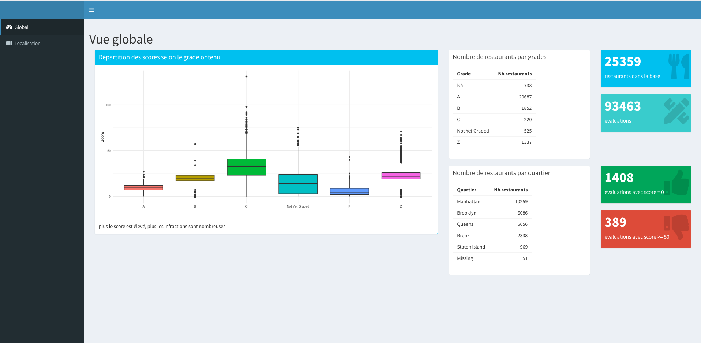

# TP 5 : Dashboard dans R sur données dans MongoDB

Nous continuons de travailler sur les restaurants new-yorkais. Nous allons créer une application shiny, en utilisant le package [`shinydashboard`](https://rstudio.github.io/shinydashboard/). Nous utiliserons aussi la librairie [`leaflet`](https://rstudio.github.io/leaflet/) pour afficher des cartes. Nous voudrions les informations suivantes :

- une *page* (ou *onglet*) **Général** donnant des informations globales sur les données
	- Distribution des scores selon le grade (dans une `box`) - par exemple sous la forme de boîtes à moustaches
	- Tableau du nombre de restaurants pour chaque grade (en ne regardant que la dernière visite) (aussi dans une `box`)
	- Tableau du nombre de restaurants pour chaque quartier (aussi dans une `box`)
	- Nombre de restaurants au total (dans un `valueBox`)
	- Nombre d'évaluations (idem)
	- Nombre d'évaluations avec un score à 0 (idem)
	- Nombre d'évaluations avec un score supérieur ou égal à 50 (idem)
- une *page* (ou *onglet*) **Carte** représentant la localisation des restaurants, et qui permettra une recherche
	- que nous compléterons par la suite

Pour réaliser cela, vous devez effectuer les étapes suivantes :

1. Créer une nouvelle application Shiny, à 2 fichiers
1. Créer le squelette de l'interface (partie UI donc)
	- Pour l'utilisation de `shinydashboard`, n'hésitez pas à aller sur [cette page](https://rstudio.github.io/shinydashboard/)
	- Quelques éléments d'information sont disponibles aussi sur [cette page](https://fxjollois.github.io/cours-2020-2021/lp-sante--tdb/shiny.html)
	- Il faudra donc créer
		- 2 onglets (un général et un *carte*)
		- 3 `box` et 4 `valueBox` dans l'onglet général
	- Dans cette partie UI, on peut déjà calculer les valeurs pour les `valueBox`
1. Créer la partie serveur
	- En amont de la fonction `shinyServer()`, il est possible de créer les `data.frame` et le `ggplot` nécessaires pour notre application

Idéalement, votre dashboard devrait ressembler à ceci :

Une fois que le dashboard est fonctionnel, vous devez réfléchir à comment on pourrait rendre son lancement plus rapide, en utilisant le stockage de variables R dans des fichiers type `RData`.

<!--
		- Tableau des restaurants n'ayant que des évaluations à 0 (nom, quartier et rue)
	- Tableau des restaurants avec les dernières évaluations les plus élevées (20 restaurants affichés ici)
-->
